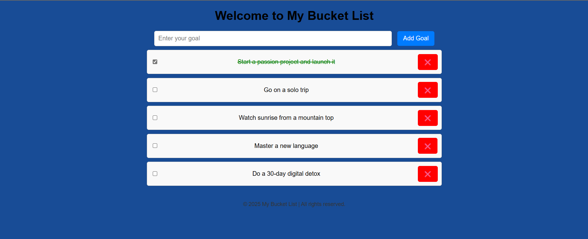

# Bucket List Website

## Description
This is a simple and interactive Bucket List website where users can add their personal goals or tasks they want to accomplish. The website allows users to add new goals, mark them as completed, and delete them. It also comes preloaded with some sample goals to get started.

## Features
- Add new goals/tasks to your bucket list.
- Mark goals as completed by checking the checkbox.
- Delete goals from the list.
- Responsive design for usability on different screen sizes.
- Preloaded sample goals on page load.

## How to Use
1. Enter your goal or task in the input field.
2. Click the "Add Goal" button to add it to your list.
3. Use the checkbox next to each goal to mark it as completed.
4. Click the red ❌ button to delete a goal from the list.

## Technologies Used
- HTML5 for structure
- CSS3 for styling and responsive design
- JavaScript for interactivity and dynamic task management

## Running the Website
Simply open the `index.html` file in any modern web browser to use the Bucket List website.

## Author
My Bucket List © 2025
## 🔍 Preview

